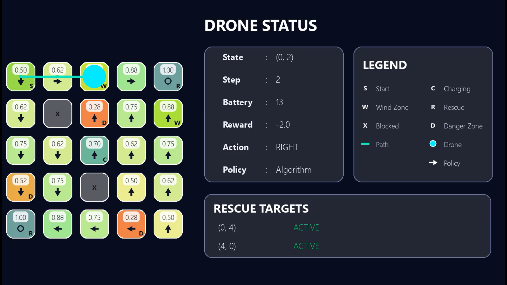
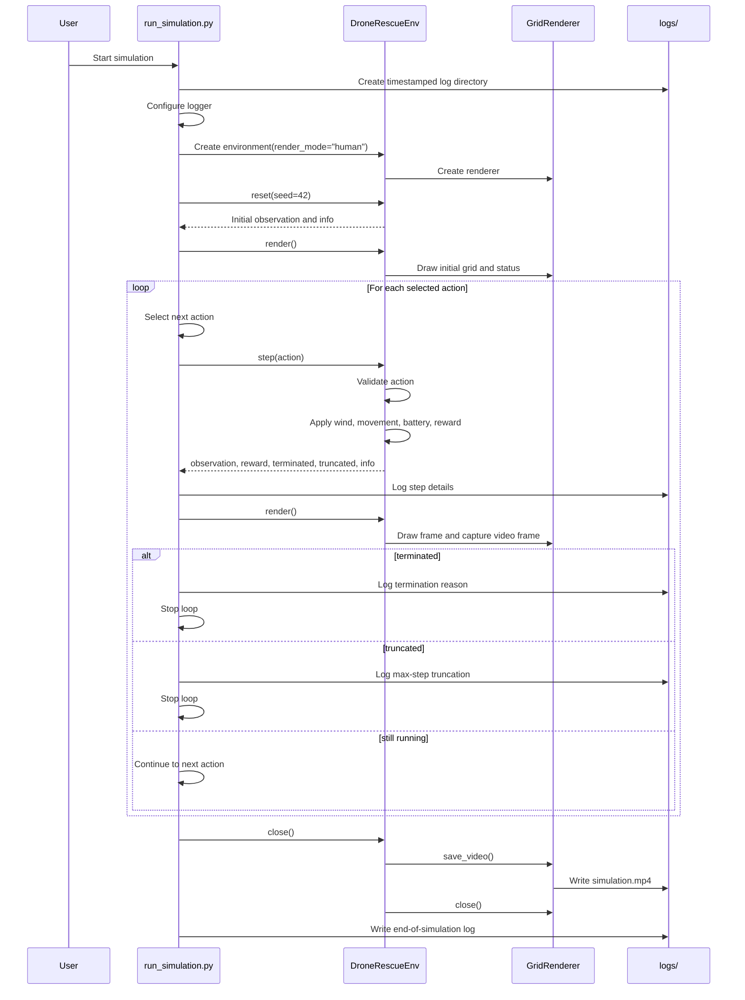

# Drone Rescue DP

This module contains a Gymnasium-style drone rescue simulation on a fixed grid.
The drone must navigate around blocked cells, manage battery usage, avoid danger
zones, handle wind disruption, recharge at charging stations, and rescue all
active targets before the episode ends.

## Requirements

- Python 3.8+
- gymnasium
- pygame
- numpy
- imageio

## Files

- `environment.py`: Core environment rules, action handling, rewards, episode
  termination, and optional rendering hooks.
- `renderer.py`: Pygame-based visual renderer and MP4 video export logic.
- `run_simulation.py`: Simulation runner with custom, algorithm, and random
  action modes.
- `planning_algorithms.py`: Placeholder for future planning algorithms (e.g., value iteration).

## Grid Legend

| Value | Cell Type        | Meaning                                   |
| ----- | ---------------- | ----------------------------------------- |
| `-1`  | Blocked Cell     | Drone cannot move into this cell.         |
| `0`   | Safe Cell        | Normal traversable cell.                  |
| `1`   | Start            | Initial drone position.                   |
| `2`   | Wind Zone        | May randomly override movement direction. |
| `3`   | Danger Zone      | Applies a negative reward.                |
| `4`   | Charging Station | Restores battery.                         |
| `5`   | Rescue Target    | Target to rescue for positive reward.     |

## Actions

| Action | Name  | Effect                                             |
| ------ | ----- | -------------------------------------------------- |
| `0`    | Up    | Move one row up.                                   |
| `1`    | Down  | Move one row down.                                 |
| `2`    | Left  | Move one column left.                              |
| `3`    | Right | Move one column right.                             |
| `4`    | Hover | Stay in place; can recharge on a charging station. |

## Rewards

| Event                    | Reward |
| ------------------------ | -----: |
| Rescue target reached    |  `+20` |
| Charging station reached |   `+5` |
| Normal step              |   `-1` |
| Danger zone reached      |  `-10` |
| Battery depleted         |  `-20` |

## Episode End Conditions

The episode terminates when:

- All rescue targets are rescued.
- The drone battery reaches zero.

The episode is truncated when:

- The step count reaches `MAX_STEPS`.

## Run The Simulation

From the repository root:

```powershell
.venv\Scripts\python.exe -m Drone_Rescue_DP.run_simulation
```

### Action Modes

The simulation supports three action modes. Edit the function call at the bottom of `run_simulation.py` to switch between them:

- **`CUSTOM_ACTION_MODE`** (default): Uses the `CUSTOM_ACTIONS` list (currently `[3, 3, 3, 3, 2, 1, 1, 2, 2, 1, 1, 2]`).
  Edit this list in `run_simulation.py` to test different action sequences.

- **`ALGORITHM_ACTION_MODE`**: Placeholder for future planning or learning logic. The environment
  supports value function visualization and policy rendering when this mode is implemented.

- **`RANDOM_ACTION_MODE`**: Samples random actions from the action space. Useful for baseline testing or
  exploring the environment behavior without predetermined actions.

### Example: Switch to Random Mode

Edit `run_simulation.py` at the bottom:

```python
if __name__ == "__main__":
    # run_simulation(action_mode=CUSTOM_ACTION_MODE)
    run_simulation(action_mode=RANDOM_ACTION_MODE)
```

### Rendering

Rendering is **enabled by default**. To disable rendering (faster execution, useful for batch testing):

```python
env = DroneRescueEnv(render_mode=None)  # Instead of render_mode="human"
```

When rendering is enabled, each frame is captured and saved to an MP4 video in the log directory.

## Environment Details

### Observation Space

The observation is a compact vector: `[row, column, battery_level]`

- **row**: Current drone row (0-4)
- **column**: Current drone column (0-4)
- **battery_level**: Current battery charge (0-15)

The drone **does not see the entire grid**—only its own position and battery state. The grid remains
accessible internally for rendering, collision detection, and reward computation.

### State Tracking

The environment internally maintains:

- **Current position**: `(row, column)` tuple
- **Battery level**: Integer from 0 to 15
- **Rescue target state**: Dictionary tracking which targets have been rescued
- **Step count**: Tracks steps toward `MAX_STEPS` truncation limit

## Outputs

Each run creates a timestamped directory under `logs/` containing:

- `simulation.log`: Step-by-step text logs.
- `simulation.mp4`: Rendered video output when rendering is enabled.

## Rendering Preview



The screenshot above is captured from the generated simulation video. It shows
the 5x5 rescue grid, current drone position, mission status, legend, and active
rescue targets.

## Sequence Diagram



## Notes For Extending

### Modifying the Environment

- **Change the grid layout**: Edit `OBSTACLE_MAP` in `environment.py` to create different rescue scenarios.
- **Adjust reward values**: Modify reward amounts in the `calculate_reward()` method.
- **Tune battery behavior**: Adjust `FULL_BATTERY_LEVEL`, `BATTERY_CONSUMPTION_PER_STEP`, and charging logic in `environment.py`.
- **Change wind probability**: Modify `WIND_PROBABILITY` constant for different difficulty levels.
- **Extend episode length**: Adjust `MAX_STEPS` constant.

### Implementing Planning Algorithms

The `planning_algorithms.py` file is a placeholder where value iteration, policy gradient, or other planning
methods can be implemented. The environment and renderer support visualization of:

- **Value function**: A 2D numpy array of state values (rendered as a heatmap).
- **Policy**: A dictionary mapping states (row, col) tuples to action indices (rendered as arrows).

See the `ValueIterationPlanner` class structure for the expected format.

### Logging and Rendering

- Keep renderer changes inside `renderer.py` so environment rules stay separate from visualization concerns.
- Logs are stored in `logs/<timestamp>/` with step-by-step text logs and a rendered MP4 video.
- The renderer can be extended to show additional information, heatmaps, or statistics.
