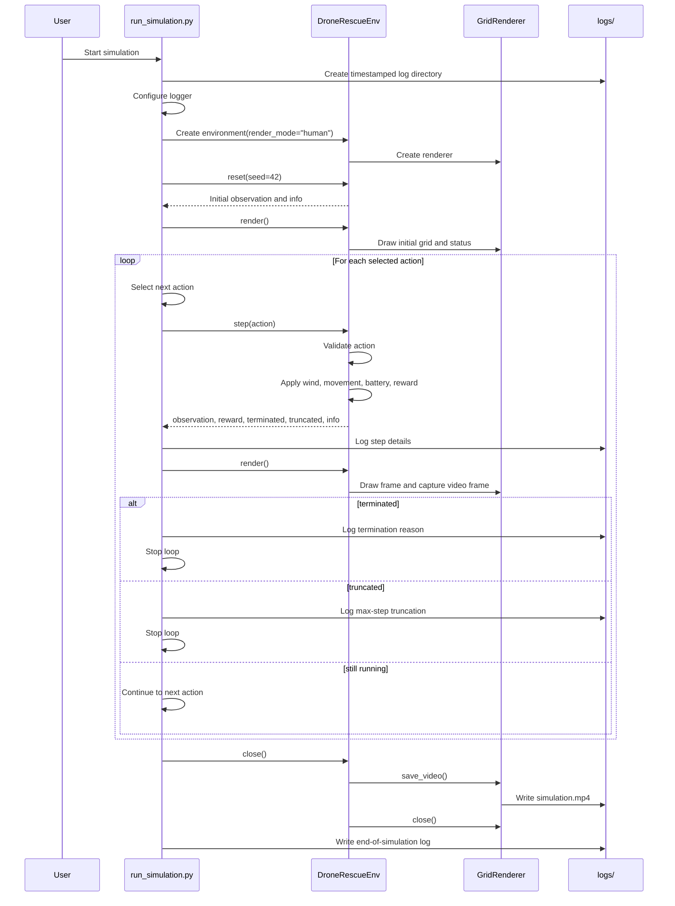

# Drone Rescue DP

This module contains a Gymnasium-style drone rescue simulation on a fixed grid.
The drone must navigate around blocked cells, manage battery usage, avoid danger
zones, handle wind disruption, recharge at charging stations, and rescue all
active targets before the episode ends.

## Files

- `environment.py`: Core environment rules, action handling, rewards, episode
  termination, and optional rendering hooks.
- `renderer.py`: Pygame-based visual renderer and MP4 video export logic.
- `run_simulation.py`: Simulation runner with custom, algorithm, and random
  action modes.

## Grid Legend

| Value | Cell Type | Meaning |
| --- | --- | --- |
| `-1` | Blocked Cell | Drone cannot move into this cell. |
| `0` | Safe Cell | Normal traversable cell. |
| `1` | Start | Initial drone position. |
| `2` | Wind Zone | May randomly override movement direction. |
| `3` | Danger Zone | Applies a negative reward. |
| `4` | Charging Station | Restores battery. |
| `5` | Rescue Target | Target to rescue for positive reward. |

## Actions

| Action | Name | Effect |
| --- | --- | --- |
| `0` | Up | Move one row up. |
| `1` | Down | Move one row down. |
| `2` | Left | Move one column left. |
| `3` | Right | Move one column right. |
| `4` | Hover | Stay in place; can recharge on a charging station. |

## Rewards

| Event | Reward |
| --- | ---: |
| Rescue target reached | `+20` |
| Charging station reached | `+5` |
| Normal step | `-1` |
| Danger zone reached | `-10` |
| Battery depleted | `-20` |

## Episode End Conditions

The episode terminates when:

- All rescue targets are rescued.
- The drone battery reaches zero.

The episode is truncated when:

- The step count reaches `MAX_STEPS`.

## Run The Simulation

From the repository root:

```powershell
.venv\Scripts\python.exe -m Drone_Rescue_DP.run_simulation
```

By default, the runner uses `CUSTOM_ACTION_MODE`. To try another mode, edit the
call at the bottom of `run_simulation.py`:

```python
run_simulation(action_mode=RANDOM_ACTION_MODE)
```

Available modes:

- `CUSTOM_ACTION_MODE`: Uses the editable `CUSTOM_ACTIONS` list.
- `ALGORITHM_ACTION_MODE`: Placeholder for future planning or learning logic.
- `RANDOM_ACTION_MODE`: Samples actions from the environment action space.

## Outputs

Each run creates a timestamped directory under `logs/` containing:

- `simulation.log`: Step-by-step text logs.
- `simulation.mp4`: Rendered video output when rendering is enabled.

## Sequence Diagram



## Notes For Extending

- Add algorithm-generated actions inside `generate_algorithm_actions`.
- Update `OBSTACLE_MAP` in `environment.py` to change the rescue layout.
- Adjust reward values in `calculate_reward`.
- Keep renderer changes inside `renderer.py` so environment rules stay separate
  from visualization concerns.
